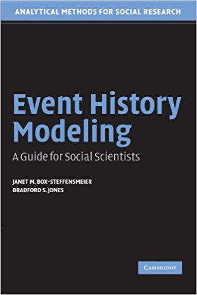

--- 
title: "Event History Modeling: A Guide for Social Scientists"
author: "Janet M. Box-Steffensmeier, Bradford S. Jones, David Darmofal"
site: bookdown::bookdown_site
output: bookdown::gitbook
documentclass: book
bibliography: [packages.bib]
biblio-style: apalike
link-citations: yes
github-repo: rstudio/bookdown-demo
description: "This is a minimal example of using the bookdown package to write a book. The output format for this example is bookdown::gitbook."
---

# Preface {-}

{}

# Event History and Social Science

# The Logic of Event History Analysis

# Parametric Models for Single-Spell Duration Data 

This chapter makes use of two different datasets: data on the duration of UN peacekeeping operations from 1948-2001 (originally used in Green et al. 1998) and data on the duration of European cabinet governments from King et al. 1990. We will start with the UN data in R and Stata first, and then move on to the cabinet data in R and Stata. 

## UN Data in R 

```{r, child = 'chapter3/ch3_un.rmd'}

```

## UN Data in Stata 

```{r, child = 'chapter3/ch3_un_stata.rmd'}

```

## Cabinet Data in R

```{r, child = 'chapter3/ch3_cabinet.rmd'}

```

## Cabinet Data in Stata

```{r, child = 'chapter3/ch3_cabinet_stata.rmd'}

```

# The Cox Proportional Hazards Model 

This chapter makes use of the cabinet data used in the previous chapter. 

## Cabinet Data in R

```{r, child = 'chapter4/ch4_cabinet.rmd'}

```

## Cabinet Data in Stata

```{r, child = 'chapter4/ch4_cabinet_stata.rmd'}

```

# Models for Discrete Data 

This chapter makes use of the International Military Interventions (IMI) dataset that has information on the duration of militarized interventions from 1946-1988 and a variety of covariates (from Pearson and Baumann 1993). Discrete data records the dependent variable as a binary outcome that either occurs or not at a specified time point. Scholars who care about the effect of time on the outcome include a variety of temporal dependences in their models, such as splines (Beck, Katz, and Tucker 1998) or time dummies. While the Beck, Katz, and Tucker splines were used extensively in the 1990s and 2000s, recent work typically makes use of cubic polynomials which are very straightforward: adding $t$, $t^2$, and $t^3$ to the regression (Carter and Signorino 2010). The advantage of cubic polynomials is that they are much simpler to implement and perform just as well as Beck, Katz, and Tucker splines. 

## Militarized Interventions Data in R

```{r, child = 'chapter5/ch5_imi.rmd'}

```

## Militarized Interventions Data in Stata

```{r, child = 'chapter5/ch5_imi_stata.rmd'}

```

# Issues in Model Selection 

This chapter makes use of data on the duration until state adoption of restrictive abortion legislation since the 1973 Roe vs. Wade Supreme Court decision (from Brace et al. 1999). 

## Restrictive Abortion Legislation Data in R

```{r, child = 'chapter6/ch6_adopt.rmd'}

```

## Restrictive Abortion Legislation Data in Stata

```{r, child = 'chapter6/ch6_adopt_stata.rmd'}

```

# Inclusion of Time-Varying Covariates

This chapter makes use of data on challenger entry in U.S. House elections.

## Warchest Data in R

```{r, child = 'chapter7/ch7_warchest.rmd'}

```

## Warchest Data in Stata 

```{r, child = 'chapter7/ch7_warchest_stata.rmd'}

```

# Diagnostic Methods for the Event History Model

This chapter makes use of the cabinet and international militarized interventions datasets used in previous chapters. 

## Cabinet Data in R

```{r, child = 'chapter8/ch8_cabinet.rmd'}

```

## Cabinet Data in Stata

```{r, child = 'chapter8/ch8_cabinet_stata.rmd'}

```

## Militarized Interventions Data in R

```{r, child = 'chapter8/ch8_imi.rmd'}

```

## Militarized Interventions Data in Stata

```{r, child = 'chapter8/ch8_imi_stata.rmd'}

```

# Some Modeling Strategies for Unobserved Heterogeneity

## Conflict Data in R

```{r, child = 'chapter9/ch9_conflict.rmd'}

```

# Models for Multiple Events

# The Social Sciences and Event History

```{r include=FALSE}
# automatically create a bib database for R packages
knitr::write_bib(c(
  .packages(), 'bookdown', 'knitr', 'rmarkdown'
), 'packages.bib')
```
